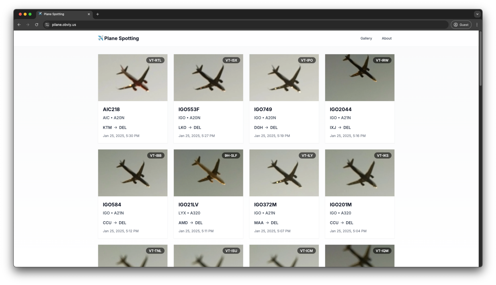

# Pi-lane Web

Astro blog for the Pi-lane project.

Images and the `flights.db` database is `rsync`'d to the `./data` directory, which is then used to build the static site.

After the build is done, it gets deployed to Cloudflare Pages using the `wrangler` CLI.

